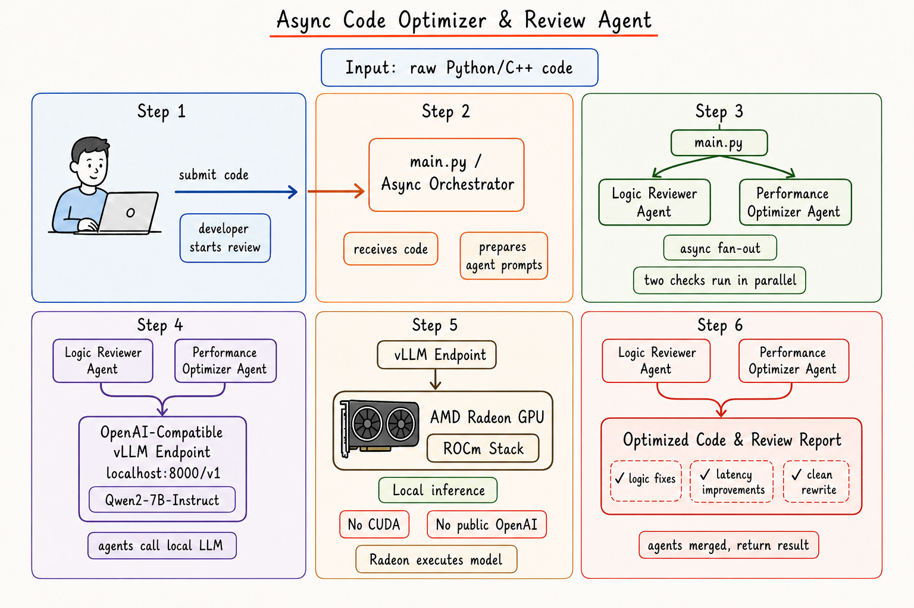
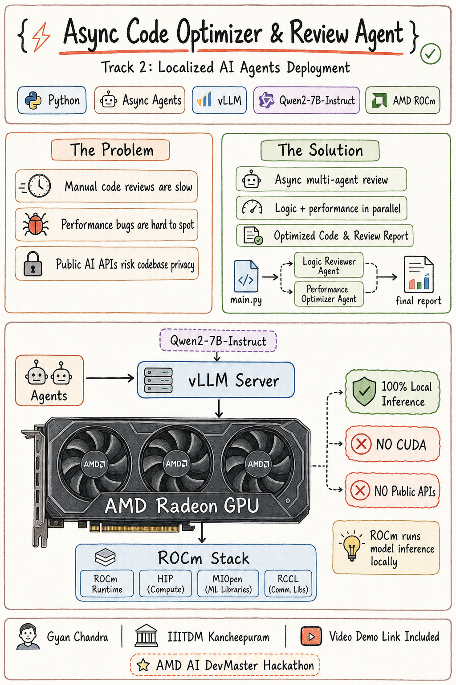
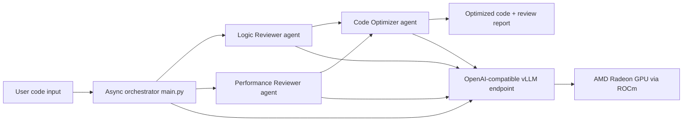

# Async Code Optimizer & Review Agent

Track 2: Localized AI Agents Deployment  
AMD AI DevMaster Hackathon

## Project Summary

Async Code Optimizer & Review Agent is a locally deployed multi-agent application that reviews Python or C++ source code for correctness risks, performance bottlenecks, and low-latency rewrite opportunities. The agents run asynchronously with CrewAI and call a local OpenAI-compatible vLLM endpoint hosted on an AMD Radeon GPU through ROCm.

Video demo: `https://drive.google.com/file/d/1aUx9utGAgvFC5h1i5Mqe4gvzqEnkt1Ro/view?usp=sharing`

Architecture diagram:



## Core Capabilities

- Asynchronous multi-agent review fan-out for faster turnaround.
- Logic and edge-case analysis for Python/C++ snippets.
- Low-latency optimization guidance focused on allocation, loop structure, data structures, and hot paths.
- Final rewritten code output with a concise change rationale.
- Local-only model serving through vLLM at `http://localhost:8000/v1`.

## Repository Structure

```text
.
|-- README.md
|-- main.py
|-- requirements.txt
`-- setup_vllm_rocm.sh
```

## System Architecture



## AMD Radeon GPU / ROCm Adaptation

The LLM is served locally with vLLM on AMD Radeon hardware using the ROCm software stack. The application never calls the public OpenAI API and does not require CUDA, NVIDIA runtime flags, or CUDA-specific Python wheels.

Key adaptation points:

- vLLM server binds to `0.0.0.0:8000` and exposes `/v1/chat/completions`.
- The agent client uses `http://localhost:8000/v1` with an OpenAI-compatible model route.
- The deployment script uses ROCm GPU devices (`/dev/kfd`, `/dev/dri`) for Docker deployment.
- The pip fallback installs ROCm-specific PyTorch and vLLM wheels from AMD ROCm indexes.
- App dependencies intentionally exclude CUDA builds such as `torch+cu*`, `nvidia-*`, and CUDA-only packages.

## Environment Setup

### 1. Start vLLM on Radeon Cloud

Recommended Docker path:

```bash
chmod +x setup_vllm_rocm.sh
./setup_vllm_rocm.sh
```

The default model is `Qwen/Qwen2-7B-Instruct`. Override settings as needed:

```bash
MODEL_ID=Qwen/Qwen2.5-7B-Instruct PORT=8000 ./setup_vllm_rocm.sh
```

For Radeon Cloud Dedicated Model API templates, use this serve command:

```bash
vllm serve Qwen/Qwen2-7B-Instruct --host 0.0.0.0 --port 8000 --dtype auto --max-model-len 8192 --gpu-memory-utilization 0.90 --trust-remote-code
```

### 2. Install Agent Dependencies

In a separate terminal:

```bash
python -m venv .venv
source .venv/bin/activate
python -m pip install --upgrade pip
python -m pip install -r requirements.txt
```

### 3. Run the Multi-Agent Optimizer

```bash
python main.py
```

Analyze a local file:

```bash
python main.py --file path/to/script.py --language python
python main.py --file path/to/kernel.cpp --language cpp
```

Use a remote Radeon Cloud dedicated endpoint instead of localhost:

```bash
LOCAL_VLLM_BASE_URL="https://<your-radeon-endpoint>/v1" \
LOCAL_VLLM_API_KEY="<your-radeon-api-key>" \
python main.py --file path/to/script.py
```

## Configuration

| Variable | Default | Description |
| --- | --- | --- |
| `LOCAL_VLLM_BASE_URL` | `http://localhost:8000/v1` | OpenAI-compatible vLLM API base URL |
| `LOCAL_VLLM_MODEL` | `Qwen/Qwen2-7B-Instruct` | Model name served by vLLM |
| `LOCAL_VLLM_API_KEY` | `EMPTY` | Local vLLM API key placeholder or Radeon endpoint key |
| `LLM_TEMPERATURE` | `0.15` | Low value for deterministic code rewrites |
| `LLM_TIMEOUT_SECONDS` | `180` | Request timeout for large reviews |

## Expected Output

The program prints:

1. Logic review findings.
2. Performance review findings.
3. Final optimized code and rationale.

## Demo Script Outline

1. Show ROCm GPU visibility on Radeon Cloud.
2. Start vLLM with `setup_vllm_rocm.sh`.
3. Verify `/v1/models` from the local endpoint.
4. Run `python main.py` with the included sample.
5. Run `python main.py --file <your-code-file>`.
6. Explain asynchronous agent fan-out and final optimizer merge.

## Submission Notes

- Pull request title: `Track 2, <TEAM_NAME>, Async Code Optimizer & Review Agent`
- Demo video: `https://drive.google.com/file/d/1aUx9utGAgvFC5h1i5Mqe4gvzqEnkt1Ro/view?usp=sharing`
- Architecture diagram:


- Team members and responsibilities: `Gyan Chandra - IIITDM Kancheepuram (Track 2: Localized AI Agents Deployment)`
